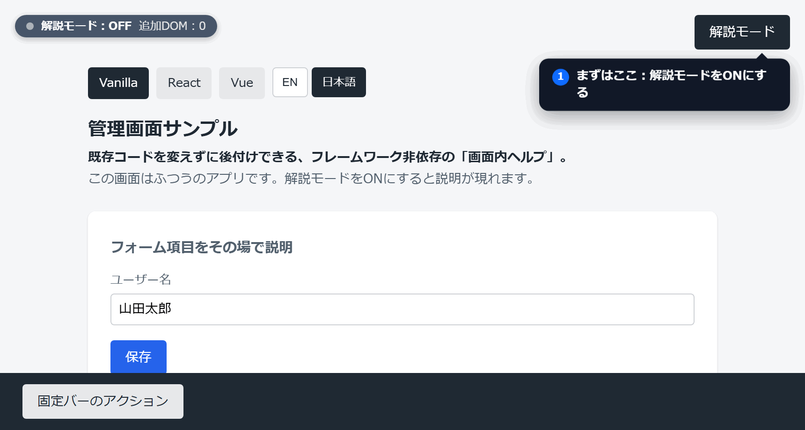

# HelpLayer

[](https://www.npmjs.com/package/help-layer)
[](./LICENSE)
[](https://github.com/Y1-Effy/HelpLayer)

[English](./README.md) | **日本語**

🔗 **ライブデモ: <https://y1-effy.github.io/HelpLayer/>**（Vanilla / React / Vue。右上の「解説モード」を ON にして「i」をクリック）



既存の Web アプリに、**既存コードを書き換えずに「画面内ヘルプ」を後付けできる**、フレームワーク非依存のライブラリです。
ユーザーが「解説モード」を ON にしている間だけ、知りたい要素の「？」マーカーをクリックして説明を読めます。通常時の見た目は一切変わりません。
仕組みは透明な遮断レイヤー — 対象要素の近くにマーカーを出しつつ、元アプリのイベントには一切触れずに操作を吸収します。

- 依存は [`@floating-ui/dom`](https://floating-ui.com/) のみ・軽量（プリビルドの IIFE で約 33KB minified、`@floating-ui/dom` 同梱）
- Shadow DOM 貫通・SPA の動的要素・マーカー同士の重なり回避・画面端でのポップアップ自動調整に対応
- キーボード操作・スクリーンリーダーに配慮（ポップアップは `role="dialog"`、開くとフォーカスを移し閉じるとマーカーへ復帰。モード中はフォーカスを UI 内に封じ込め、`Esc` で閉じる）
- ON→OFF で追加した DOM・イベント・スタイルを**完全後始末**
- モダンブラウザ（Chromium / Firefox / WebKit）で動作（e2e を 3 エンジンで検証）

## 目次

- [なぜ HelpLayer か（既存手段との違い）](#なぜ-helplayer-か既存手段との違い)
- [こんなときに（導入が刺さるケース）](#こんなときに導入が刺さるケース)
- [インストール](#インストール)
- [クイックスタート](#クイックスタート)
- [自由配置（要素に紐づけない説明）](#自由配置要素に紐づけない説明)
- [API](#api)
- [テーマ（CSS カスタムプロパティ）](#テーマcss-カスタムプロパティ)
- [既知の制約](#既知の制約)
- [セキュリティ](#セキュリティ)
- [開発](#開発)

## なぜ HelpLayer か（既存手段との違い）

画面に説明を足す手段はいくつもありますが、それぞれ別の前提を抱えています。HelpLayer は
**「ユーザーが知りたい箇所だけを、その場で自由に選んで確認できる解説モード」** に振り切ることで、
通常時の見た目も既存コードも一切犠牲にしないことを狙っています。

- **プロダクトツアー型（ステップ案内）との違い** … 決められた順路を上から押し付けるのではなく、
  ユーザーが見たい要素を選んでその場で開ける **探索型**。読み終えたいタイミングも順序もユーザーに委ねます。
- **常設ツールチップとの違い** … 説明を常時表示してUIを煩雑にすることがありません。マーカーは
  **モードON中だけ**出るので、**通常時のデザインは一切変わりません**。
- **DAP系SaaS（Digital Adoption Platform＝定着化支援 SaaS）との違い**
  … 外部基盤・契約・トラッキングを必要とせず、**ランニングコスト0・依存1つ・約33KB の完全ローカル動作**。
  CSP / Trusted Types にも対応するため、持ち込み制約の厳しい環境にも入ります。

そのうえで共通の核として、**既存コードを書き換えずに後付け**でき、**フレームワーク非依存**で、
元アプリのイベントには触れず（透明な遮断レイヤーで操作を吸収）、**ON→OFF で完全に後始末**します。

| | プロダクトツアー型 | 常設ツールチップ | DAP系SaaS | **HelpLayer** |
|---|---|---|---|---|
| 提示形式 | 線形ステップになりがち | 常時表示になりがち | サービス依存 | **モードON中だけ・任意箇所を探索** |
| 通常時のUI | 実装次第 | 煩雑になりがち | 実装次第 | **一切変えない** |
| 導入方法 | 多くは要組み込み | CSS/JS を追記 | スニペット＋外部基盤＋契約 | **後付け・既存コード非改変** |
| コスト／運用 | 実装次第 | ローカル | 月額＋トラッキング運用 | **ランニング0・依存1つ** |

> ※ HelpLayer は DAP の **フル代替ではありません**。アナリティクスやセグメント別配信、複雑なフロー誘導・
> オンボーディング自動化といった高機能は対象外で、**「画面内に説明を出す」というコア機能だけを最小コストで満たす**ことに
> 振り切っています。逆に、強い導線を引きたい・利用状況を計測したいといった目的が主なら、DAP やツアーの方が向きます。

## こんなときに（導入が刺さるケース）

- **DAP／ガイド系 SaaS のコストが見合わず、解約を検討している。でも解約すると画面内ヘルプがゼロに戻る。**
  → 「画面内に説明を出す」というコア機能だけを、依存1つ・ランニングコスト0 で自前に残せます。乗り換え後の受け皿に。
- **SaaS を契約する予算感はないが、ヘルプは拡張したい。**
  → npm か `<script>` 1本で後付け。月額もアカウントも要りません。
- **オフィスソフトで別途マニュアルを作る・更新するのが重い。しかも作っても読まれない。**
  → 説明を画面内のその要素に同居させます（`data-help-title`／`data-help-text` か小さな config だけ）。
  別ドキュメントの保守から解放され、UI と説明がズレません。
- **オンボーディングは欲しいが、強制的なツアーは押し付けがましい**ので避けたい。
  → ユーザーが見たい箇所を選んでその場で開く探索型なので、操作を中断させません。
- **外部 SaaS を持ち込めない環境**（厳格な CSP・プライバシー要件・閉域網・トラッキング不可）。
  → 外部通信なしの完全ローカル動作で要件を満たします。
- **React / Vue などフレームワークを問わず**、描画ライブラリにも手を入れずに導入したい。
  → フレームワーク非依存・後付けで、既存コードを書き換えません。

> 業務システム・管理画面は最初に刺さりやすい例として挙げていますが、用途はそこに限りません。
> もちろん **一般的な Web サイト** でも、申込み・問い合わせ・予約などのフォームで「この項目に何を入れるか」を
> マーカー＋ポップアップで補えます。「説明を後付けしたい既存 Web ページ」全般が対象で、別途マニュアルを
> 用意する運用の軽い代替にもなります。

> 💡 **デスクトップアプリにも使えます。** Electron / Tauri などはアプリ画面を WebView（HTML/DOM）で描画して
> いるため、Web アプリとまったく同じ感覚で HelpLayer を後付けできます。ネイティブ風の画面に「解説モード」を
> 足したいときの選択肢としても、意外と素直にハマります。

## インストール

```sh
npm install help-layer
```

バンドラを使わず `<script>` 1本で導入したい場合は、プリビルドの IIFE を読み込めばグローバル `HelpLayer` が生えます（後述）。

TypeScript の型定義を同梱しています（`package.json` の `types` が `dist/types` を指す）。TS プロジェクトでは追加設定なしで型補完が効きます。

## クイックスタート

### 1. config オブジェクトで定義する

対象要素に `data-help-id` を付け、その値をキーにした説明を渡します。

```html
<button data-help-id="save">保存</button>
<button id="help-toggle">解説モード</button>
```

```js
import { initHelpLayer } from 'help-layer';

initHelpLayer({
  toggle: '#help-toggle',
  config: {
    save: { title: '保存', text: '入力内容を保存します。' },
  },
});
```

### 2. マークアップに直接書く（説明の config 定義なしでも可。`config: {}` 自体は必要）

説明をマークアップと同居させたい場合は、`data-help-title` / `data-help-text` を要素に直接書くだけで対象になります。
`config` と併用でき、**同じキーが config にあれば config が優先**されます。

```html
<button data-help-title="保存" data-help-text="入力内容を保存します。">保存</button>
```

```js
initHelpLayer({ toggle: '#help-toggle', config: {} });
```

### `<script>` だけで使う（バンドラなし）

CDN から読む場合は、改ざん検知のため **バージョンを固定** し、**SRI（`integrity`）** を付けることを推奨します。

```html
<script
  src="https://unpkg.com/help-layer@1.0.1/dist/help-layer.iife.js"
  integrity="sha384-……（公開版のハッシュに差し替え）"
  crossorigin="anonymous"></script>
<script>
  HelpLayer.initHelpLayer({
    toggle: '#help-toggle',
    config: { save: { title: '保存', text: '入力内容を保存します。' } },
  });
</script>
```

> `integrity` のハッシュは公開した実ファイルから生成します。例:
> `curl -s https://unpkg.com/help-layer@1.0.1/dist/help-layer.iife.js | openssl dgst -sha384 -binary | openssl base64 -A`
> （バージョンを固定しないと SRI と不整合になり読み込みが拒否されます。）

## 自由配置（要素に紐づけない説明）

`position` を指定すると、特定要素ではなくページ座標にマーカーを置けます（画面全体の説明などに）。

```js
config: {
  intro: { title: 'この画面について', text: '…', position: { top: 80, left: 560 } },
}
```

## API

```js
const help = initHelpLayer(options);
help.enable();   // ON
help.disable();  // OFF
help.toggle();   // 反転
help.isActive(); // boolean
help.open(key);  // 指定キーの説明を開く（OFF 中なら自動で ON）
help.close();    // 開いている説明を閉じる（モードは ON のまま）
help.update(newConfig); // config を差し替え（ON 中なら無音で再構築。onEnable/onDisable は呼ばれない）
help.destroy();  // リスナー解除＋完全後始末
```

### options

| オプション | 型 | 既定 | 説明 |
|------|------|------|------|
| `config` | `object` | （必須） | キー→`{ title, text, position? }`。`data-help-id` 値 or 自由配置キー |
| `toggle` | `string \| HTMLElement` | なし | ON/OFF するトグル要素。省略時は API 制御のみ |
| `attribute` | `string` | `'data-help-id'` | 対象を示す属性名 |
| `render` | `(record) => Node \| null` | なし | 本文を自前 DOM で描画。返り値が無ければ安全なテキスト表示にフォールバック（タイトルは常に `record.title`） |
| `markerLabel` | `string` | `'?'` | マーカーに表示する文字 |
| `markerPlacement` | `Placement` | `'top-end'` | マーカーを重ねる隅（`top-end`/`top-start`/`bottom-end`/`bottom-start`） |
| `popupPlacement` | `Placement` | `'bottom-start'` | ポップアップ初期配置（画面端では自動で flip/shift） |
| `nonce` | `string` | なし | 厳格な CSP（`style-src 'nonce-…'`）下で注入 `<style>` を許可するための nonce（後述） |
| `silent` | `boolean` | `false` | 未登録キーの警告ログを抑止 |

### コールバック

| オプション | タイミング |
|------|------|
| `onEnable` | モードを ON にした直後 |
| `onDisable` | モードを OFF にした直後 |
| `onOpen(record)` | 説明ポップアップを開いた時 |
| `onClose` | 説明ポップアップを閉じた時 |

> ※ ON 中に説明を開いたまま `update()` / `disable()` / `destroy()` すると、後始末で説明が閉じるため `onClose` が一度発火します。

### 本文に改行を入れる / リンクを置く

本文は安全のため既定で `textContent`（HTML を解釈しない）ですが、`\n` は改行として表示されます。
リンクや装飾が必要なら `render` で任意の DOM を返してください。

```js
initHelpLayer({
  config,
  render(record) {
    if (record.key !== 'save') {
      return null; // 既定のテキスト表示にフォールバック
    }
    const a = document.createElement('a');
    a.href = '/docs/save';
    a.textContent = 'くわしくはこちら';
    return a;
  },
});
```

> ⚠️ **セキュリティ:** `render` が返した DOM は**そのまま挿入され、ライブラリ側ではサニタイズしません**。
> ユーザー入力など未信頼のデータを使う場合は、`innerHTML` で組み立てず `textContent` を使うか、
> [DOMPurify](https://github.com/cure53/DOMPurify) 等で無害化してから返してください（XSS 防止）。
> 既定（`render` 未指定）の `title`/`text` 描画は `textContent` なので安全です。

## テーマ（CSS カスタムプロパティ）

見た目はホスト側 CSS で以下の変数を上書きするだけで変えられます。ダークモード（`prefers-color-scheme: dark`）の
既定値も内蔵していますが、変数を指定すればそちらが常に優先されます。

| 変数 | 既定 | 用途 |
|------|------|------|
| `--help-layer-marker-size` | `22px` | マーカー直径 |
| `--help-layer-marker-bg` | `#2563eb` | マーカー背景色 |
| `--help-layer-marker-color` | `#fff` | マーカー文字色 |
| `--help-layer-popup-bg` | `#fff` | ポップアップ背景色 |
| `--help-layer-popup-color` | `#1f2933` | ポップアップ文字色 |
| `--help-layer-popup-max-width` | `280px` | ポップアップ最大幅 |
| `--help-layer-popup-max-height` | `50vh` | ポップアップ本文の最大高さ（超過時は本文のみスクロール） |
| `--help-layer-accent` | `#1d4ed8` | フォーカスリング色 |
| `--help-layer-overlay-bg` | `transparent` | 遮断レイヤー（スクリム）背景色。`rgba(0,0,0,0.15)` 等で操作不能状態を可視化 |
| `--help-layer-overlay-cursor` | `default` | 遮断領域上のカーソル。`not-allowed` / `help` 等 |

## 既知の制約

- closed な Shadow DOM は JS から到達できないため非対応（open のみ貫通）。
- マーカーを隅へ重ねるオフセットは既定マーカーサイズ（22px）前提。`--help-layer-marker-size` を大きく変えると
  わずかにズレることがあります。

## セキュリティ

- 設計上、`title` / `text` の描画は `textContent` のみで、`innerHTML` / `eval` / `new Function` は**一切使いません**。
- 外部通信（`fetch` 等）・`localStorage` / `cookie` などのストレージ利用も**ありません**（完全ローカル動作）。
- 唯一、未信頼データを HTML／DOM ノードとして挿入しうる経路は `render` オプションです。戻り値はサニタイズされないため、
  ユーザー入力を含む場合は呼び出し側で無害化してください（上記「本文に改行を入れる / リンクを置く」参照）。
- ランタイム依存は `@floating-ui/dom` のみ。CDN 利用時は前述のとおりバージョン固定＋SRI を推奨します。

### Content Security Policy（CSP）

本ライブラリは `innerHTML` / `eval` を使わないため **Trusted Types（`require-trusted-types-for 'script'`）に
そのまま対応** しています。位置決めは要素の `.style`（CSSOM）への直接代入で行うため CSP の対象外です。

一点だけ注意が必要なのは、見た目用に注入する **`<style>` タグ** です。`style-src` に `'unsafe-inline'` も
nonce も無い**厳格な CSP** ではこの `<style>` がブロックされ、マーカーやポップアップのスタイルが当たりません。
`style-src 'nonce-…'` 運用のサイトでは、リクエストごとの nonce を `nonce` オプションで渡してください。

```js
// サーバが毎リクエスト発行する nonce（CSP ヘッダの style-src 'nonce-xxxx' と同じ値）を渡す
initHelpLayer({ config, toggle: '#help-toggle', nonce: pageNonce });
```

これで注入される `<style nonce="xxxx">` が CSP に許可され、厳格 CSP 下でも正しく表示されます。
`'unsafe-inline'` を許可しているサイトや CSP 未設定のサイトでは `nonce` は不要です。

## 開発

| 目的 | コマンド |
|------|----------|
| テスト | `npm test` |
| Lint / 型チェック / 一括 | `npm run lint` / `npm run typecheck` / `npm run check` |
| デモ起動 | `npm run demo` |
| 配布物ビルド | `npm run build`（`dist/` に ESM・IIFE・型定義） |

## リポジトリ

- ソース: <https://github.com/Y1-Effy/HelpLayer>
- バグ報告・要望: <https://github.com/Y1-Effy/HelpLayer/issues>
- ライセンス: [ISC](./LICENSE)
