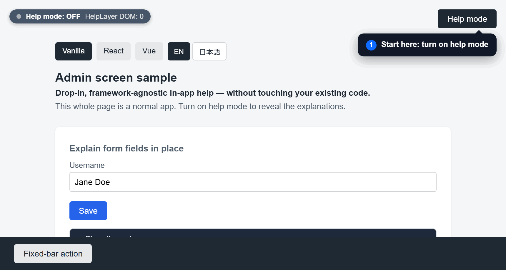

# HelpLayer

[](https://www.npmjs.com/package/help-layer)
[](./LICENSE)
[](https://github.com/Y1-Effy/HelpLayer)

**English** | [日本語](./README.ja.md)

🔗 **Live demo: <https://y1-effy.github.io/HelpLayer/>** (Vanilla / React / Vue — turn on "Help mode" top-right, then click an "i")



A **framework-agnostic "help mode" library you can drop into any existing web app**.
While the mode is ON, it shows a "?" marker next to each target element; clicking it opens a description popup. The normal appearance is completely unchanged.
It never touches the host app's own event listeners — a transparent blocking layer absorbs interaction instead — so you can adopt it without rewriting existing code.

- Only one dependency, [`@floating-ui/dom`](https://floating-ui.com/); lightweight (the prebuilt IIFE is ~33KB minified, with `@floating-ui/dom` bundled in)
- Pierces Shadow DOM, keeps up with dynamically added/removed elements in SPAs, avoids marker-to-marker overlap, and auto-adjusts the popup at screen edges
- Mindful of keyboard use and screen readers (the popup is `role="dialog"`; opening moves focus and closing returns it to the marker; while the mode is on, focus is trapped within the UI, and `Esc` closes it)
- Fully cleans up the DOM, listeners, and styles it added when you turn it OFF
- Works in modern browsers (Chromium / Firefox / WebKit; e2e is verified across all three engines)

## Table of contents

- [Why HelpLayer (vs. existing options)](#why-helplayer-vs-existing-options)
- [When it fits (where adoption pays off)](#when-it-fits-where-adoption-pays-off)
- [Installation](#installation)
- [Quick start](#quick-start)
- [Free placement (descriptions not bound to an element)](#free-placement-descriptions-not-bound-to-an-element)
- [API](#api)
- [Theming (CSS custom properties)](#theming-css-custom-properties)
- [Known limitations](#known-limitations)
- [Security](#security)
- [Development](#development)

## Why HelpLayer (vs. existing options)

There are many ways to add explanations to a screen, but each comes with its own assumptions. HelpLayer
commits fully to **"a help mode where users freely pick just the spots they want to understand and check
them on the spot,"** aiming to sacrifice neither the normal look nor your existing code.

- **vs. product tours (step-by-step guidance)** … Rather than marching users along a fixed route,
  it's **exploratory**: users pick the element they want and open it right there. The timing and order of
  reading are left entirely to the user.
- **vs. always-on tooltips** … It never clutters the UI by showing explanations all the time. Markers
  appear **only while the mode is ON**, so **the normal design is completely unchanged**.
- **vs. DAP SaaS (Digital Adoption Platform)** … No external platform, contract, or tracking required —
  **zero running cost, one dependency, ~33KB, fully local**. It also supports CSP / Trusted Types, so it
  fits environments with strict constraints on what you can bring in.

On top of that, they all share a common core: you can **drop it in without rewriting existing code**, it's
**framework-agnostic**, it never touches the host app's own events (a transparent blocking layer absorbs
interaction), and it **fully cleans up on ON→OFF**.

| | Product tours | Always-on tooltips | DAP SaaS | **HelpLayer** |
|---|---|---|---|---|
| Presentation | tends to be linear steps | tends to be always visible | service-dependent | **only while ON · explore any spot** |
| Normal UI | depends on implementation | tends to get cluttered | depends on implementation | **left entirely unchanged** |
| Adoption | usually needs integration | add CSS/JS | snippet + external platform + contract | **drop-in · no existing-code changes** |
| Cost / ops | depends on implementation | local | monthly fee + tracking ops | **zero running cost · one dependency** |

> Note: HelpLayer is **not a full replacement for a DAP**. Advanced features like analytics, segmented
> delivery, complex flow guidance, and onboarding automation are out of scope — it commits to
> **satisfying just the core "show explanations in-screen" function at minimal cost**. Conversely, if your
> main goal is to drive strong funnels or measure usage, a DAP or a tour is the better fit.

## When it fits (where adoption pays off)

- **A DAP / guide SaaS isn't worth the cost and you're considering canceling — but canceling drops your
  in-screen help back to zero.**
  → Keep just the core "show explanations in-screen" function in-house, with one dependency and zero
  running cost. It gives you a place to land after switching away.
- **You don't have the budget to contract a SaaS, but you want to expand your help.**
  → Drop it in with npm or a single `<script>`. No monthly fee, no account.
- **Maintaining a separate manual in an office suite is a chore — and nobody reads it even when you do.**
  → Co-locate the explanation with the very element on screen (`data-help-title` / `data-help-text` or a
  small config). You're freed from maintaining a separate doc, and the UI and its explanation never drift apart.
- **You want onboarding, but a forced tour feels pushy** and you'd rather avoid it.
  → It's exploratory — users pick what they want and open it on the spot — so it never interrupts their work.
- **Environments where you can't bring in an external SaaS** (strict CSP, privacy requirements, closed
  networks, no tracking allowed).
  → It meets those requirements with fully local operation and no external communication.
- **Regardless of framework (React / Vue, etc.)**, you want to adopt it without touching your rendering library.
  → Framework-agnostic and drop-in; it doesn't rewrite your existing code.

> Business systems and admin screens are the easiest fit, but the use isn't limited to
> them. On **ordinary websites** too, you can supplement "what to enter in this field" on signup, contact,
> or reservation forms with a marker + popup. Any "existing web page you want to add explanations to" is in
> scope, and it makes a lightweight alternative to maintaining a separate manual.

> 💡 **It works for desktop apps, too.** Electron / Tauri and the like render their app screens with a
> WebView (HTML/DOM), so you can drop HelpLayer in exactly as you would in a web app. It's a surprisingly
> natural option when you want to add a "help mode" to a native-feeling screen.

## Installation

```sh
npm install help-layer
```

If you'd rather drop it in with a single `<script>` and no bundler, load the prebuilt IIFE, which exposes a global `HelpLayer` (see below).

TypeScript type definitions are bundled (`package.json`'s `types` points to `dist/types`), so type completion works with no extra setup in TS projects.

## Quick start

### 1. Define targets with a config object

Add `data-help-id` to a target element and pass a description keyed by that value.

```html
<button data-help-id="save">Save</button>
<button id="help-toggle">Help mode</button>
```

```js
import { initHelpLayer } from 'help-layer';

initHelpLayer({
  toggle: '#help-toggle',
  config: {
    save: { title: 'Save', text: 'Saves your input.' },
  },
});
```

### 2. Write it inline in your markup (no per-entry config needed; `config: {}` still required)

If you'd rather keep descriptions next to your markup, just add `data-help-title` / `data-help-text` to an element and it becomes a target.
This can be combined with `config`, and **if the same key exists in `config`, the config wins**.

```html
<button data-help-title="Save" data-help-text="Saves your input.">Save</button>
```

```js
initHelpLayer({ toggle: '#help-toggle', config: {} });
```

### Use it with just a `<script>` (no bundler)

When loading from a CDN, we recommend **pinning the version** and adding **SRI (`integrity`)** so tampering is detectable.

```html
<script
  src="https://unpkg.com/help-layer@1.0.1/dist/help-layer.iife.js"
  integrity="sha384-……(replace with the published file's hash)"
  crossorigin="anonymous"></script>
<script>
  HelpLayer.initHelpLayer({
    toggle: '#help-toggle',
    config: { save: { title: 'Save', text: 'Saves your input.' } },
  });
</script>
```

> Generate the `integrity` hash from the actually published file, e.g.:
> `curl -s https://unpkg.com/help-layer@1.0.1/dist/help-layer.iife.js | openssl dgst -sha384 -binary | openssl base64 -A`
> (If you don't pin the version, the SRI will mismatch and the browser will refuse to load it.)

## Free placement (descriptions not bound to an element)

Specify `position` to place a marker at a page coordinate instead of on a specific element (useful for whole-screen descriptions, etc.).

```js
config: {
  intro: { title: 'About this screen', text: '…', position: { top: 80, left: 560 } },
}
```

## API

```js
const help = initHelpLayer(options);
help.enable();   // ON
help.disable();  // OFF
help.toggle();   // flip ON/OFF
help.isActive(); // boolean
help.open(key);  // open the description for the given key (auto-enables if OFF)
help.close();    // close the open description (the mode stays ON)
help.update(newConfig); // replace the config (rebuilds silently if ON; onEnable/onDisable are not called)
help.destroy();  // detach listeners + full cleanup
```

### Options

| Option | Type | Default | Description |
|------|------|------|------|
| `config` | `object` | (required) | key → `{ title, text, position? }`. The key is a `data-help-id` value or a free-placement key |
| `toggle` | `string \| HTMLElement` | none | the toggle element that switches ON/OFF. If omitted, control is programmatic-only |
| `attribute` | `string` | `'data-help-id'` | attribute name marking targets |
| `render` | `(record) => Node \| null` | none | render the body with your own DOM. Falls back to safe text display when nothing is returned (the title is always `record.title`) |
| `markerLabel` | `string` | `'?'` | the character shown on the marker |
| `markerPlacement` | `Placement` | `'top-end'` | corner to overlap the marker onto (`top-end`/`top-start`/`bottom-end`/`bottom-start`) |
| `popupPlacement` | `Placement` | `'bottom-start'` | initial popup placement (flips/shifts automatically at screen edges) |
| `nonce` | `string` | none | nonce to allow the injected `<style>` under a strict CSP (`style-src 'nonce-…'`); see below |
| `silent` | `boolean` | `false` | suppress the warning log for unregistered keys |

### Callbacks

| Option | When it fires |
|------|------|
| `onEnable` | right after the mode is turned ON |
| `onDisable` | right after the mode is turned OFF |
| `onOpen(record)` | when a description popup is opened |
| `onClose` | when a description popup is closed |

> Note: if a description is open when you call `update()` / `disable()` / `destroy()`, the cleanup closes it, so `onClose` fires once.

### Line breaks & links in the body

For safety the body is rendered with `textContent` by default (HTML is not interpreted), but `\n` is shown as a line break.
If you need links or styling, return your own DOM from `render`.

```js
initHelpLayer({
  config,
  render(record) {
    if (record.key !== 'save') {
      return null; // fall back to the default text display
    }
    const a = document.createElement('a');
    a.href = '/docs/save';
    a.textContent = 'Learn more';
    return a;
  },
});
```

> ⚠️ **Security:** the DOM returned by `render` is **inserted as-is and is not sanitized by the library**.
> If you use untrusted data (e.g. user input), don't build it with `innerHTML` — use `textContent`, or
> neutralize it with something like [DOMPurify](https://github.com/cure53/DOMPurify) before returning it (to prevent XSS).
> The default (no `render`) `title`/`text` rendering uses `textContent`, so it is safe.

## Theming (CSS custom properties)

You can change the look just by overriding the following variables in your host CSS. Dark-mode defaults
(`prefers-color-scheme: dark`) are built in, but any variable you set always wins via `var()`.

| Variable | Default | Purpose |
|------|------|------|
| `--help-layer-marker-size` | `22px` | marker diameter |
| `--help-layer-marker-bg` | `#2563eb` | marker background color |
| `--help-layer-marker-color` | `#fff` | marker text color |
| `--help-layer-popup-bg` | `#fff` | popup background color |
| `--help-layer-popup-color` | `#1f2933` | popup text color |
| `--help-layer-popup-max-width` | `280px` | popup max width |
| `--help-layer-popup-max-height` | `50vh` | popup body max height (the body scrolls when exceeded) |
| `--help-layer-accent` | `#1d4ed8` | focus ring color |
| `--help-layer-overlay-bg` | `transparent` | blocking-layer (scrim) background; e.g. `rgba(0,0,0,0.15)` to signal the host is inactive |
| `--help-layer-overlay-cursor` | `default` | cursor over the blocked area; e.g. `not-allowed` / `help` |

## Known limitations

- Closed Shadow DOM is unreachable from JS, so it is unsupported (only open shadow roots are pierced).
- The offset that overlaps the marker onto a corner assumes the default marker size (22px). Changing
  `--help-layer-marker-size` significantly may cause a slight drift.

## Security

- By design, `title` / `text` are rendered with `textContent` only; `innerHTML` / `eval` / `new Function` are **never used**.
- There is **no external communication** (`fetch`, etc.) and **no storage use** (`localStorage` / `cookie`) — it runs fully locally.
- The only path through which untrusted data is inserted into the DOM as HTML / DOM nodes is the `render` option. Its return value is not sanitized, so
  neutralize it on the caller side if it contains user input (see "Line breaks & links in the body" above).
- The only runtime dependency is `@floating-ui/dom`. When using a CDN, pin the version and add SRI as noted above.

### Content Security Policy (CSP)

Because this library never uses `innerHTML` / `eval`, it **works as-is with Trusted Types
(`require-trusted-types-for 'script'`)**. Positioning is done by assigning directly to an element's `.style` (CSSOM),
which is outside the scope of CSP.

The one thing to watch out for is the **`<style>` tag** injected for appearance. Under a **strict CSP** whose
`style-src` has neither `'unsafe-inline'` nor a nonce, this `<style>` is blocked and the markers/popup get no styles.
On sites that operate with `style-src 'nonce-…'`, pass the per-request nonce via the `nonce` option.

```js
// pass the nonce your server issues per request (the same value as `style-src 'nonce-xxxx'` in the CSP header)
initHelpLayer({ config, toggle: '#help-toggle', nonce: pageNonce });
```

This lets the injected `<style nonce="xxxx">` be allowed by the CSP, so it renders correctly even under a strict CSP.
On sites that allow `'unsafe-inline'` or have no CSP, `nonce` is not needed.

## Development

| Purpose | Command |
|------|----------|
| Test | `npm test` |
| Lint / typecheck / all | `npm run lint` / `npm run typecheck` / `npm run check` |
| Run the demo | `npm run demo` |
| Build the distribution | `npm run build` (emits ESM, IIFE, and type definitions to `dist/`) |

## Repository

- Source: <https://github.com/Y1-Effy/HelpLayer>
- Issues & requests: <https://github.com/Y1-Effy/HelpLayer/issues>
- License: [ISC](./LICENSE)
